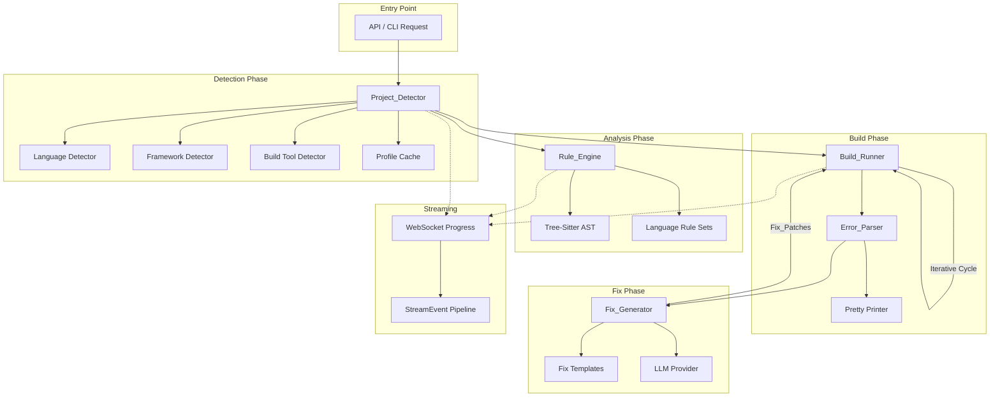

# Design Document: Universal Repo Handler

## Overview

The Universal Repo Handler extends AI_SUPPORT from its current Python/C/embedded focus into a true multi-language engineering intelligence platform. It introduces a pipeline that accepts any repository, automatically detects languages and build systems, applies language-specific static analysis, discovers and executes builds, parses compiler errors into structured objects, generates fix suggestions, and iteratively resolves build failures — all with real-time WebSocket progress streaming.

The design builds on existing infrastructure:
- **Rule Engine** (`src/infrastructure/analysis/rule_engine.py`) — extended with per-language rule sets
- **Compile Error Fixer** (`src/infrastructure/analysis/compile_error_fixer.py`) — generalized for gcc, rustc, go, javac
- **Fix Engine** (`src/core/fix_engine/`) — reused for patch application and confidence scoring
- **Streaming** (`src/core/streaming/stream.py`) — extended with pipeline progress events
- **Project Indexer** (`src/infrastructure/analysis/project_indexer.py`) — generalized beyond firmware

### Design Decisions

| Decision | Choice | Rationale |
|----------|--------|-----------|
| Language detection strategy | File extension + shebang + marker heuristics | Fast, no external dependencies, sufficient accuracy for 8 primary languages |
| AST parsing library | tree-sitter via `tree-sitter-languages` | Already in dependencies, supports all target languages, battle-tested |
| Build execution isolation | `asyncio.subprocess` with timeout | Lightweight, no Docker required for local agent, aligns with existing subprocess patterns |
| Error parser architecture | Strategy pattern per compiler | Each compiler has unique output format; strategy pattern keeps parsers independent |
| Caching strategy | Content-hash of file tree + disk cache | Fast invalidation, leverages existing `infrastructure/cache/disk/` |
| Progress streaming | Extend existing `StreamEvent` model | Avoids new WebSocket infrastructure, consistent with current UI integration |
| Fix generation approach | Template-first, LLM-fallback | Templates are fast and deterministic for common patterns; LLM handles novel errors |

## Architecture



### Pipeline Flow

1. **Detection** — Scan repository, build `Project_Profile`, cache result
2. **Analysis** — Load language-specific rules, run tree-sitter AST analysis
3. **Build** — Discover build command, execute with timeout, capture output
4. **Parse** — Parse compiler output into structured `Compiler_Error` objects
5. **Fix** — Generate `Fix_Patch` suggestions (template or LLM)
6. **Iterate** — Apply high-confidence fixes, re-run build (max 3 cycles)
7. **Report** — Emit final results with all errors, fixes, and outcomes

Each phase emits `StreamEvent` progress updates via WebSocket.

## Components and Interfaces

### Project_Detector

```python
class ProjectDetector:
    """Scans a repository and produces a Project_Profile."""

    async def detect(self, repo_path: Path) -> ProjectProfile:
        """Full detection: languages, frameworks, build tools."""
        ...

    async def detect_languages(self, repo_path: Path) -> LanguageDistribution:
        """Scan file extensions, shebangs, and markers."""
        ...

    async def detect_frameworks(self, repo_path: Path, languages: LanguageDistribution) -> list[Framework]:
        """Identify frameworks from config files and imports."""
        ...

    async def detect_build_tools(self, repo_path: Path) -> list[BuildToolInfo]:
        """Discover build tools from config files at project root."""
        ...

    def get_cached_profile(self, repo_path: Path) -> ProjectProfile | None:
        """Return cached profile if file tree hash matches."""
        ...

    def invalidate_cache(self, repo_path: Path) -> None:
        """Invalidate cache for a repository."""
        ...
```

### Rule_Engine (Extended)

```python
class UniversalRuleEngine(RuleEngine):
    """Extends existing RuleEngine with multi-language rule loading."""

    def load_rules_for_profile(self, profile: ProjectProfile) -> None:
        """Load language-specific rule sets based on detected languages."""
        ...

    async def analyze_file(self, file_path: Path, language: str) -> list[Finding]:
        """Analyze a single file with all applicable rules."""
        ...

    async def analyze_project(
        self, repo_path: Path, profile: ProjectProfile, progress_sink: StreamSink | None = None
    ) -> list[Finding]:
        """Analyze entire project with progress streaming."""
        ...
```

### Build_Runner

```python
class BuildRunner:
    """Discovers and executes build commands with iterative fix cycles."""

    async def run_build(
        self, repo_path: Path, profile: ProjectProfile, progress_sink: StreamSink | None = None
    ) -> BuildResult:
        """Execute build and capture errors."""
        ...

    async def run_iterative_fix_cycle(
        self, repo_path: Path, profile: ProjectProfile, max_iterations: int = 3
    ) -> IterativeBuildResult:
        """Run build → fix → rebuild cycle."""
        ...

    async def install_dependencies(self, repo_path: Path, profile: ProjectProfile) -> DependencyResult:
        """Run dependency installation as pre-build step."""
        ...

    def construct_build_command(self, profile: ProjectProfile) -> BuildCommand:
        """Construct the appropriate build command from profile."""
        ...
```

### Error_Parser

```python
class ErrorParser:
    """Parses compiler output into structured Compiler_Error objects."""

    def parse(self, output: str, compiler: str) -> list[CompilerError]:
        """Parse raw compiler output using the appropriate strategy."""
        ...

    def format(self, error: CompilerError, style: str) -> str:
        """Format a CompilerError back into human-readable string."""
        ...

    def register_parser(self, compiler: str, parser: CompilerOutputParser) -> None:
        """Register a custom parser for a compiler."""
        ...
```

### Fix_Generator

```python
class FixGenerator:
    """Generates Fix_Patch suggestions from errors and findings."""

    async def generate_fix(self, error: CompilerError, context: FileContext) -> list[FixPatch]:
        """Generate fix suggestions for a compiler error."""
        ...

    async def generate_fix_from_finding(self, finding: Finding, context: FileContext) -> list[FixPatch]:
        """Generate fix from a static analysis finding."""
        ...

    def get_template_fix(self, error: CompilerError) -> FixPatch | None:
        """Attempt template-based fix before LLM fallback."""
        ...

    async def get_llm_fix(self, error: CompilerError, context: FileContext) -> FixPatch | None:
        """Generate fix using LLM with confidence scoring."""
        ...
```

### Progress Streaming

```python
class PipelineProgressEmitter:
    """Emits structured progress events for each pipeline phase."""

    async def emit_detection_progress(self, files_scanned: int, total_files: int, phase: str) -> None:
        ...

    async def emit_analysis_progress(self, files_analyzed: int, findings_count: int, current_file: str) -> None:
        ...

    async def emit_build_progress(self, output_line: str, phase: str) -> None:
        ...

    async def emit_phase_complete(self, phase: str, summary: dict, duration_ms: float) -> None:
        ...
```

## Data Models

```python
@dataclass
class ProjectProfile:
    """Complete detection result for a repository."""
    repo_path: Path
    languages: LanguageDistribution
    frameworks: list[Framework]
    build_tools: list[BuildToolInfo]
    entry_points: list[Path]
    dependency_manifests: list[Path]
    confidence: float  # 0.0 - 1.0
    detected_at: datetime
    file_tree_hash: str


@dataclass
class LanguageDistribution:
    """Language breakdown of a repository."""
    primary_language: str
    languages: dict[str, LanguageStats]  # language -> stats

    @dataclass
    class LanguageStats:
        file_count: int
        lines_of_code: int
        percentage_files: float
        percentage_loc: float


@dataclass
class BuildToolInfo:
    """Detected build tool with its configuration."""
    name: str  # "npm", "cargo", "cmake", "make", etc.
    config_file: Path
    build_commands: list[str]
    relevance_score: float  # Ranking by proximity and dependency position


@dataclass
class Framework:
    """Detected framework."""
    name: str
    version: str | None
    language: str
    detected_from: str  # Which config/import pattern triggered detection


@dataclass
class BuildCommand:
    """A discovered or configured build command."""
    command: list[str]
    working_directory: Path
    environment: dict[str, str]
    timeout_seconds: int = 180


@dataclass
class CompilerError:
    """Structured representation of a single compiler error."""
    file_path: str
    line: int
    column: int
    severity: str  # "error", "warning", "note"
    error_code: str  # e.g., "TS2304", "E0308", "C2065"
    message: str
    compiler: str  # "gcc", "tsc", "rustc", "go", "javac"
    raw_output: str = ""
    suggestions: list[str] = field(default_factory=list)


@dataclass
class FixPatch:
    """A code repair suggestion."""
    file_path: str
    line_start: int
    line_end: int
    old_code: str
    new_code: str
    explanation: str
    confidence: float  # 0.0 - 1.0
    source: str  # "template" or "llm"
    error_ref: CompilerError | None = None


@dataclass
class BuildResult:
    """Result of a single build execution."""
    success: bool
    errors: list[CompilerError]
    warnings: list[CompilerError]
    output: str
    duration_ms: float
    command: BuildCommand


@dataclass
class IterativeBuildResult:
    """Result of the full iterative build-fix cycle."""
    final_success: bool
    iterations_run: int
    errors_resolved: list[CompilerError]
    errors_remaining: list[CompilerError]
    patches_applied: list[FixPatch]
    patches_failed: list[FixPatch]
    build_results: list[BuildResult]


@dataclass
class DependencyResult:
    """Result of dependency installation."""
    success: bool
    installed_packages: list[str]
    failed_packages: list[str]
    error_message: str = ""


@dataclass
class PipelineProgressEvent:
    """Progress event for WebSocket streaming."""
    phase: str  # "detection", "analysis", "build", "fix", "complete"
    progress_percent: float
    message: str
    data: dict[str, Any] = field(default_factory=dict)
    timestamp: float = field(default_factory=time.time)
```
