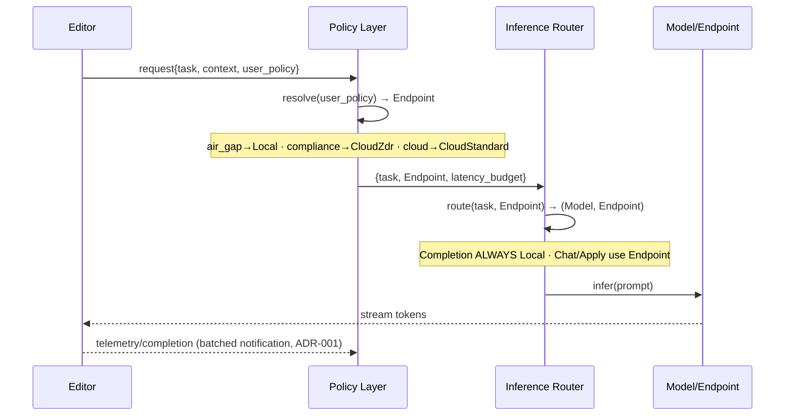

# Design — Policy Layer & Inference Router (ADR-003)

Status: **Design** (paper).

> **Principle (ADR-003):** privacy is a *legal* property, not an inference
> *location*. The Policy Layer maps the user's trust tier to an **endpoint**;
> the Inference Router maps the **task** to a **model**. Keeping them separate
> means a policy change never touches routing logic, and vice versa.

## 1. Two stages, two concerns

| Stage | Input | Output | Concern |
|---|---|---|---|
| **Policy Layer** | `user_policy` | `Endpoint` (trust tier) | *Where is it legally allowed to run?* |
| **Inference Router** | `task`, `Endpoint`, latency budget | `(Model, Endpoint)` | *What's the right model for this task?* |

`Endpoint` ∈ { `Local`, `CloudZdr`, `CloudStandard` }.
`user_policy` ∈ { `air_gap`, `compliance`, `cloud` }.

## 2. Policy Layer resolution

```
air_gap     → Local           (code never leaves the machine)
compliance  → CloudZdr        (frontier model, BAA signed, zero data retention)
cloud       → CloudStandard   (default; best quality/cost)
```

## 3. Inference Router resolution

The router takes the policy-chosen endpoint and the task. **Completion is always
Local regardless of endpoint** — latency (<300ms) wins, and FIM context is
already local. Heavier tasks use the policy endpoint.

| Task | air_gap (Local) | compliance (CloudZdr) | cloud (CloudStandard) |
|---|---|---|---|
| Completion | Qwen-3B (local) | **Qwen-3B (local)** | **Qwen-3B (local)** |
| NextEdit (mechanical) | — SQL, no model — | — SQL, no model — | — SQL, no model — |
| NextEdit (semantic) | Qwen-7B (local) | Haiku 4.5 (ZDR) | Haiku 4.5 |
| Apply | Qwen-7B (local) | Haiku 4.5 (ZDR) | Haiku 4.5 |
| Chat / Agent | Qwen-7B (local) | Sonnet 4.6 (ZDR) | Sonnet 4.6 |
| Embedding | local embed | local embed | local embed |

Note the guarantee: under `air_gap` every cell is Local — the router can never
route a chat to the cloud because the Policy Layer already collapsed the
endpoint to `Local`. The router cannot *override* policy; it only chooses a
model *within* the allowed endpoint.

## 4. Sequence (ASCII)

```
Editor                 Policy Layer            Inference Router         Model/Endpoint
  │                         │                        │                        │
  │ request{task, context,  │                        │                        │
  │   user_policy}          │                        │                        │
  ├────────────────────────►│                        │                        │
  │                         │ resolve(user_policy)   │                        │
  │                         │   → Endpoint           │                        │
  │                         ├───────────────────────►│                        │
  │                         │   {task, Endpoint,     │                        │
  │                         │    latency_budget}     │ route(task, Endpoint)  │
  │                         │                        │   → (Model, Endpoint)  │
  │                         │                        ├───────────────────────►│
  │                         │                        │                        │ infer
  │                         │                        │◄───────────────────────┤ (stream)
  │◄───────────────────────────────────────────────────────────────────────┤
  │  (on accept/reject) telemetry/completion  (batched notification, ADR-001)│
  ├──────────────────────────────────────────────────────────────────────► core sink
```

## 5. Sequence (mermaid, for GitHub)



## 6. Why the split is non-negotiable

- **Policy changes are common and high-stakes** (an enterprise signs a BAA, a
  user toggles air-gap). They must be one function, auditable, with no model
  logic mixed in.
- **Routing changes are frequent and low-stakes** (a new fast model, a latency
  tweak). They must not be able to *violate* policy — structurally impossible
  here because the router only ever sees the already-collapsed `Endpoint`.
- **Testability**: Policy Layer is a pure `user_policy → Endpoint` table;
  Router is a pure `(task, Endpoint) → (Model, Endpoint)` table. Both unit-test
  without touching a network.
